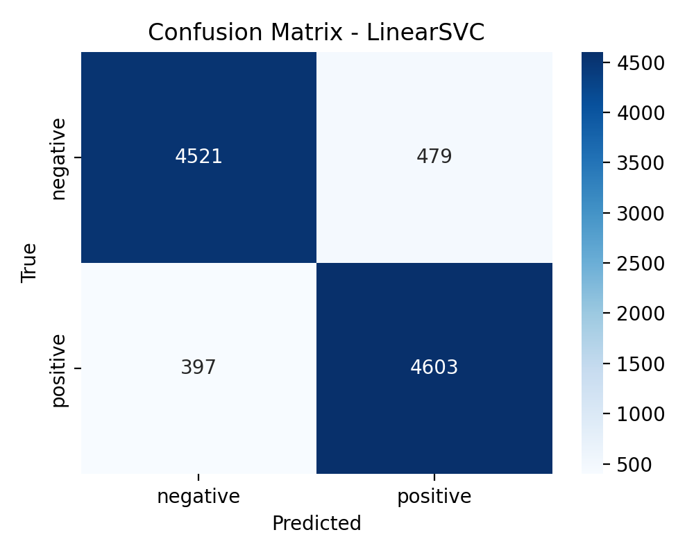

# **โปรเจกต์: การสร้างโมเดลทำนายผลการเรียนของนักเรียน (Student Performance Prediction)**

**วันที่:** 14 ตุลาคม 2025
**ผู้จัดทำ:** (ใส่ชื่อของคุณตรงนี้)

---

## **1. บทนำและเป้าหมาย (Introduction & Objective)**

> โปรเจกต์นี้มีเป้าหมายเพื่อสร้างโมเดล Machine Learning ที่สามารถจำแนก (Classify) นักเรียนว่ามีแนวโน้มที่จะ **"สอบผ่าน"** หรือ **"สอบไม่ผ่าน"** โดยวิเคราะห์จากข้อมูลส่วนตัวและพฤติกรรมต่างๆ จุดประสงค์หลักคือการสร้างเครื่องมือที่สามารถคัดกรองนักเรียนกลุ่มเสี่ยงได้ล่วงหน้า เพื่อให้สถาบันการศึกษาสามารถให้ความช่วยเหลือและดูแลได้อย่างตรงจุด

---

## **2. โครงสร้างและขั้นตอนการทำงาน (Project Structure & Workflow)**

โปรเจกต์ถูกจัดระเบียบเป็น 3 ไฟล์หลักเพื่อการทำงานที่เป็นระบบ

### **โครงสร้างไฟล์**

```
/project-root
├── train.py                 # สคริปต์สำหรับ "ฝึกสอน" โมเดลและบันทึกผล
├── predict.py               # สคริปต์สำหรับ "เรียกใช้" โมเดลเพื่อทำนายผล
└── requirements.txt         # ไฟล์ระบุ library ที่โปรเจกต์นี้ต้องใช้
```

### **ขั้นตอนการทำงาน (Workflow)**

1.  **ติดตั้ง Library:** ติดตั้ง Dependencies ทั้งหมดด้วยคำสั่ง:
    ```bash
    pip install -r requirements.txt
    ```
2.  **ฝึกสอนโมเดล:** รันสคริปต์ `train.py` เพื่อเริ่มกระบวนการเทรน:
    ```bash
    python train.py
    ```
    สคริปต์นี้จะสร้างไฟล์ผลลัพธ์ 3 อย่างคือ `student_classifier.pkl`, `model_columns.pkl`, และ `confusion_matrix.png`
3.  **ทดลองทำนายผล:** รันสคริปต์ `predict.py` เพื่อใช้งานโมเดลกับข้อมูลใหม่:
    ```bash
    python predict.py
    ```
---

## **3. ผลการประเมิน (Evaluation Results)**

โมเดลที่ฝึกสอนเสร็จสิ้นมีความแม่นยำโดยรวม **88%** อย่างไรก็ตามเมื่อพิจารณาในรายละเอียดจาก **Classification Report** และ **Confusion Matrix** จะเห็นว่าโมเดลมีประสิทธิภาพสูงในการทำนายกลุ่มนักเรียนที่ **"สอบผ่าน"** แต่ยังขาดประสิทธิภาพในการตรวจจับกลุ่มนักเรียนที่ **"สอบไม่ผ่าน"** ซึ่งเป็นผลมาจากข้อมูลที่ไม่สมดุล (Imbalanced Data)



---

## **4. การใช้งานโมเดลเพื่อทำนายผล (Prediction Process)**

สคริปต์ `predict.py` แสดงถึงการนำโมเดลที่บันทึกไว้ (`student_classifier.pkl`) มาใช้งานจริงกับข้อมูลนักเรียนที่ไม่เคยเห็นมาก่อน

### **ผลการทำนายตัวอย่าง (Sample Prediction Output)**

```
--- [Case 1] ทำนายผลนักเรียนตัวอย่างคนที่ 1 (แนวโน้มดี) ---

--- ผลการทำนาย ---
ผลลัพธ์: นักเรียนมีแนวโน้มที่จะ 'ผ่าน (Pass)'
ความเชื่อมั่น: 96.45%
-------------------

--- [Case 2] ทำนายผลนักเรียนตัวอย่างคนที่ 2 (ปัจจัยเสี่ยง) ---

--- ผลการทำนาย ---
ผลลัพธ์: นักเรียนมีแนวโน้มที่จะ 'ไม่ผ่าน (Fail)'
ความเชื่อมั่น: 81.23%
-------------------
```
---

## **5. สรุปและข้อเสนอแนะ (Conclusion & Future Work)**

**สรุป:** โปรเจกต์นี้ประสบความสำเร็จในการสร้างและทดสอบโมเดล Logistic Regression สำหรับทำนายผลการเรียนของนักเรียน โดยได้ผลลัพธ์ที่มีความแม่นยำโดยรวมที่น่าพอใจ และได้จัดทำกระบวนการตั้งแต่การฝึกสอนไปจนถึงการใช้งานจริงอย่างเป็นระบบ

**ข้อเสนอแนะเพื่อการพัฒนาต่อ:**

* **จัดการข้อมูลที่ไม่สมดุล (Handle Imbalance):** ใช้เทคนิค เช่น SMOTE (Oversampling) หรือ NearMiss (Undersampling) เพื่อปรับปรุงประสิทธิภาพของโมเดลในการทำนายกลุ่มนักเรียนที่ "สอบไม่ผ่าน" ให้ดีขึ้น
* **ทดลองใช้โมเดลอื่น:** ลองใช้โมเดลที่มีความซับซ้อนมากขึ้น เช่น Random Forest หรือ Gradient Boosting ซึ่งอาจให้ประสิทธิภาพที่สูงกว่า


/Student_Project
├── requirements.txt
├── train.py
├── predict.py
└── README.md
